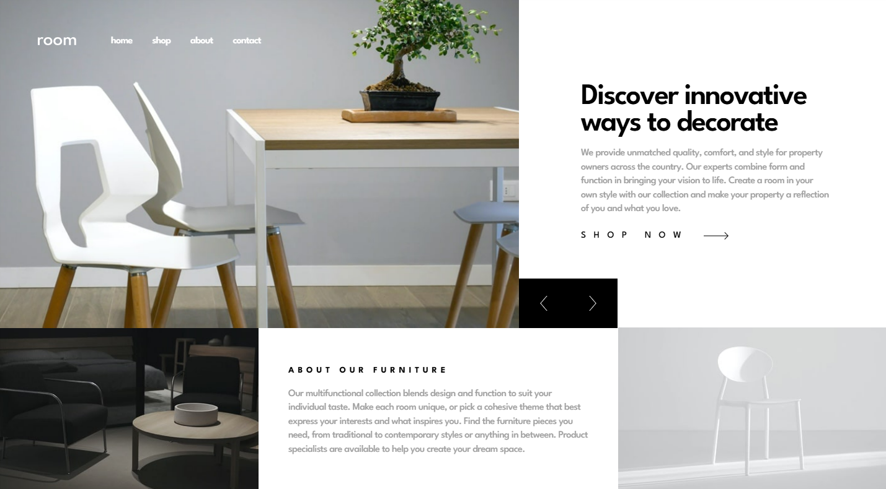

# 🏠 Room Homepage
Esta es una solución al [desafío Room Homepage en Frontend Mentor](https://www.frontendmentor.io/challenges/room-homepage-BtdBY_ENq). Los desafíos de Frontend Mentor ayudan a mejorar tus habilidades de programación creando proyectos realistas.

## 🔎 Descripción general
Diseño responsive para resolución mobile(375px), tablet(768px) y desktop(1440px)

### 📷 Captura de pantalla

### 🔗 Links
- [URL de la solucion](https://www.frontendmentor.io/solutions/room-homepage-solution-UDqjxLxPjM)
- [URL del sitio en vivo](https://braismarquez2025.github.io/room-homepage/)

## 🚀 Mi proceso

### 🔧 Llevado a cabo con
- React + Vite
- Sass

### 💡 Lo que aprendí
He comprendido bien el uso del contexto gracias a este proyecto! Me parece súper útil ya que se necesita cierta información en distintos componentes. Un ejemplo de esto es el estado del menu, necesitamos saber si está abierto o está cerrado para activar el overlay, por ejemplo. El más claro son los distintos textos e imágenes que hacen falta a la hora de visualizar las distintas versiones de la página cuando el usuario clica en las fechas, menudo escándalo sería escribir esto en todos los componentes. 

### 📈 Desarrollo continuo
Lo que más me ha costado ha sido diseñar la página en resolución desktop, ya que siempre surge algún que otro desajuste. Me ha gustado el resultado excepto porque ha quedado un pequeño scroll vertical, el cual no he conseguido eliminar, si alguien me puede ayudar me serviría mucho el apoyo ya que no le he encontrado solución.
Me encantaría recibir críticas constructivas sobre como puedo mejorar mi código. Cualquier feedback se agradece! 🙌

### ✌️ Autor 
- 💼 GitHub - https://github.com/braismarquez2025
- ✉️ Gmail - braismarquez2003@gmail.com
- 👤 Usuario de Frontend - [@braismarquez2025](https://www.frontendmentor.io/profile/braismarquez2025)
- 🔗 LinkedIn - [Brais Márquez](https://www.linkedin.com/in/brais-m%C3%A1rquez-b133b7365/)
